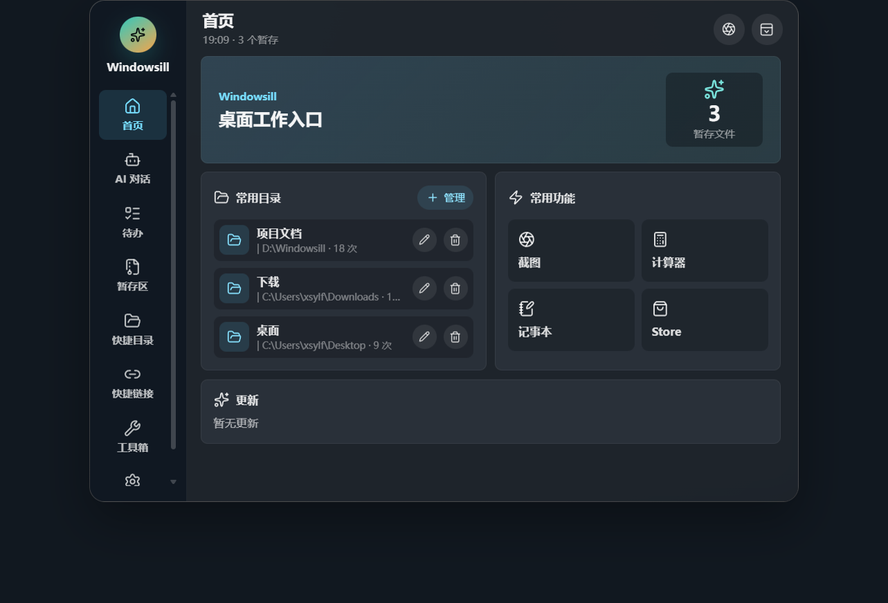
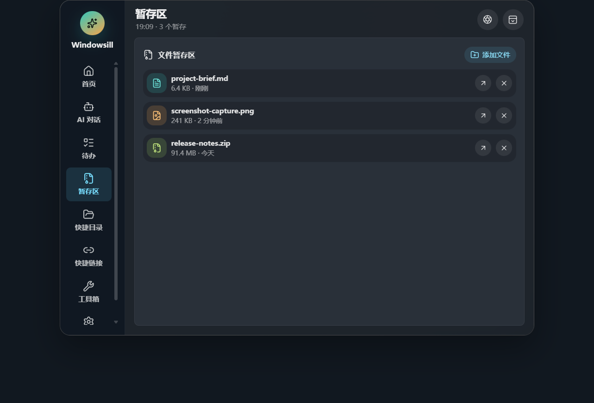
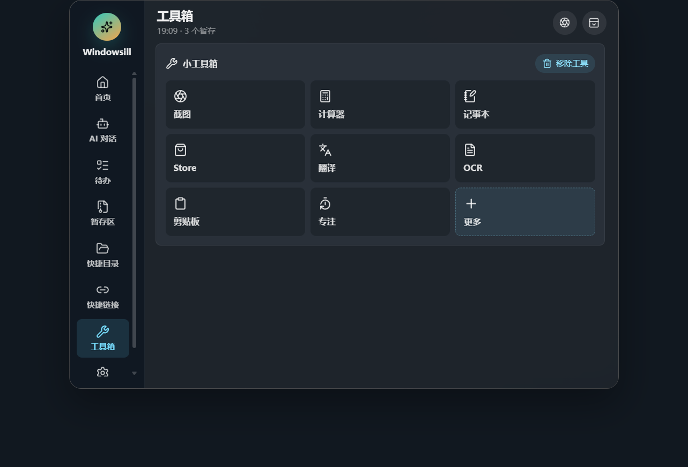

# Windowsill

> A tiny desktop shelf for Windows: part Dynamic Island, part local toolbox, part AI sidekick.

[](https://github.com/mornhussakuyo-hub/Windowsill/releases)
[](LICENSE)
[](https://www.electronjs.org/)
[](https://react.dev/)

Windowsill 是一个 Windows 桌面智能浮岛。平时它是一颗安静的小胶囊，放在你喜欢的位置；需要时展开成一个轻量工作台，帮你聊天、暂存文件、看剪贴板、做 OCR、截图、记待办、跳目录、开工具。

它不是一个“再打开一个大窗口”的效率工具。更像桌面边缘的一块小窗台：文件先搁一下，想法先放一下，常用动作一伸手就够到。



## 现在能做什么

- **浮岛形态**：呼出、隐藏、拖动、记住位置，展开和收起都有独立动画。
- **AI 对话**：支持 OpenAI 兼容接口，DeepSeek、OpenAI 或自建网关都能配。
- **Agent 能力**：AI 可以搜索暂存区文件、剪贴板历史，并调用本机 OCR。
- **文件暂存区**：文件拖进来，稍后再打开、定位、移除，也能原生拖出去。
- **Windows OCR**：调用系统 `Windows.Media.Ocr`，不用模型 OCR 也能识别图片文字。
- **系统截图**：直接调 Windows 截图入口，截图结果可以进入暂存区。
- **剪贴板历史**：记录最近文本和图片，AI 也能读取当前剪贴板。
- **快捷目录 / 快捷链接**：给目录和网址起名，按访问频率排序。
- **待办**：火速、一般、悠闲三级优先级，带创建和修改时间。
- **小工具箱**：截图、OCR、翻译、剪贴板、专注、计算器、记事本、Microsoft Store 等工具可自定义显示。
- **设置页**：开机自启、置顶、失焦自动收起、快捷键、AI 参数、窗口位置、工具布局都能在应用里改。

## 截图

| 文件暂存区 | 小工具箱 |
| --- | --- |
|  |  |

## 安装

从 [GitHub Releases](https://github.com/mornhussakuyo-hub/Windowsill/releases) 下载最新版安装包：

```text
Windowsill-Setup-0.1.1.exe
```

安装器支持选择安装位置、创建桌面快捷方式和安装后启动。

> 说明：安装包接近 100 MB 主要是因为 Electron 需要携带 Chromium 和 Node.js 运行时。这是桌面端跨平台技术栈的常见体积。

## AI 配置

你可以在应用的设置页里直接配置 AI，也可以复制 `.env.example` 为 `.env`：

```env
WINDOWSILL_AI_PROVIDER=DeepSeek
WINDOWSILL_AI_KEY=你的 key
WINDOWSILL_AI_MODEL=deepseek-chat
WINDOWSILL_AI_BASE_URL=https://api.deepseek.com/v1
WINDOWSILL_AI_TEMPERATURE=0.6
```

`.env` 改完后需要重启应用。设置页保存的配置会写入本机用户数据目录。

## 开发

```bash
npm install
npm run dev
```

只构建前端：

```bash
npx vite build
```

构建 Windows 安装包：

```bash
npm run build
```

构建产物会输出到 `release/`。

## 本地能力

Windowsill 尽量把“能在本机完成的事”留在本机：

- OCR 使用 Windows 自带 OCR 引擎。
- 截图使用 Windows 系统截图入口。
- 计算器打开 `calc.exe`。
- 记事本打开 `notepad.exe`。
- Microsoft Store 通过 `ms-windows-store://home` 打开。
- 快捷链接交给系统默认浏览器。

## 项目结构

```text
electron/                 Electron 主进程、preload、Agent 和本地仓库层
electron/agent/           AI agent 调度与工具调用
electron/repositories/    剪贴板等本地数据仓库
src/                      React 前端应用
src/app/                  应用状态和主入口
src/components/           UI 组件
src/styles/               拆分后的样式文件
docs/screenshots/         README 截图
build/                    安装器说明和应用图标
```

## 路线图

- 更完整的 Agent 工具协议和可视化执行记录。
- 更多本地小工具，比如二维码、颜色拾取、窗口管理、快速搜索。
- 更稳的自动更新体验。
- 更细的文件预览和拖拽目标反馈。
- 插件化工具箱，让工具能被用户自由添加。

## 参与

这个项目还在快速试验期，欢迎 issue、PR 和奇怪但有用的想法。桌面效率工具最有趣的地方，就是每个人都有自己的小工作流；Windowsill 希望把这些小工作流收进一个不打扰人的地方。

## 许可证

MIT License. See [LICENSE](LICENSE).
